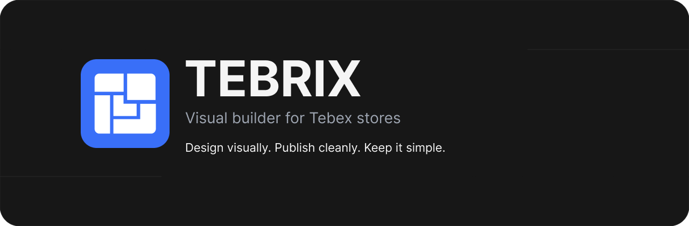

<div align="center">
  
</div>

<div align="center">
  
  
  
</div>

<br />

<div align="center">
  <strong>Structured storefront building for Tebex.</strong><br/>
  Clean layouts, simple controls, and a product-first editing experience.
</div>

<br />


## Overview

Tebrix is a visual builder for Tebex stores.

It is being designed to make storefront building feel fast, clear, and modern — without turning the editor into a complicated design tool.

The focus is simple:

- structured layouts
- clean styling controls
- strong defaults
- responsive by default
- minimal UI overhead

## What we are building

Tebrix is centered around an element-based editor with a clean tree structure.

Instead of editing code or dealing with messy template files, the goal is to let creators build with:

- containers
- text
- buttons
- images
- inputs
- spacing and layout controls
- theme-driven styling

All while keeping the editing experience lightweight and predictable.

## Product direction

<table>
  <tr>
    <td width="33%" valign="top">
      <h3>Simple</h3>
      <p>Minimal controls, better defaults, and less clutter.</p>
    </td>
    <td width="33%" valign="top">
      <h3>Structured</h3>
      <p>Container-based layouts instead of freeform chaos.</p>
    </td>
    <td width="33%" valign="top">
      <h3>Modern</h3>
      <p>Clean storefronts that feel current by default.</p>
    </td>
  </tr>
</table>

## Stack

```txt
Next.js
React
TypeScript
Tailwind CSS
shadcn/ui
```

## Principles

- Keep complexity out of the main UI
- Make common actions obvious
- Prefer presets over noise
- Keep everything responsive by default
- Build a tool that feels polished, not heavy

## Current focus

- editor architecture
- element system
- layout controls
- style tokens
- Tebex-friendly output


## Activity

<div align="center">
  
</div>

## Connect

<div align="center">
  <a href="https://github.com/Tebrix-Studio">
    
  </a>

  <a href="https://example.com">
    
  </a>
</div>

<br />

<div align="center">
  
</div>
